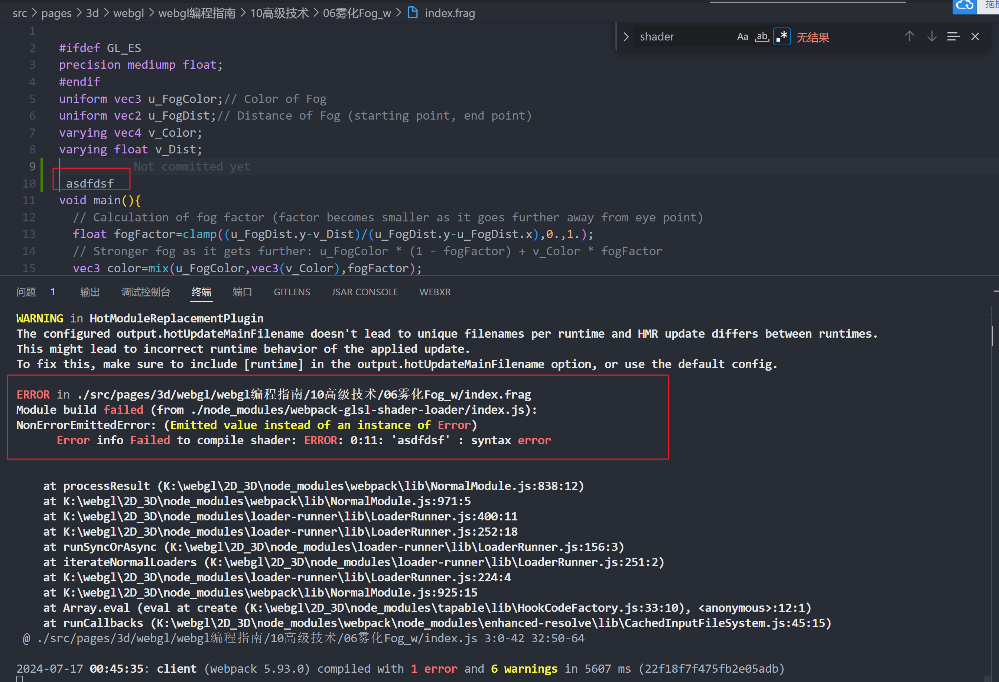

# webpack-glsl-shader-loader

## 中文

这是一个着色器加载器，它还具有检查编译着色器的是否正确功能。



### 安装

```
npm i webpack-glsl-shader-loader
//or
yarn add  webpack-glsl-shader-loader
```

首先我们的shader 需要分为两个文件， 一个是 .vert 后缀的文件 和  .frag 后缀的文件，

/app/index.vert 文件内容

```

  attribute vec4 a_Position;
  void main() {
    gl_Position = a_Position;
    gl_PointSize = 10.0; 
  } 

```

  /app/index.frag 文件内容

```

  attribute vec4 a_Position;
  void main() {
    gl_Position = a_Position;
    gl_PointSize = 10.0; 
  } 

```

/app/index.js

```
import FSHADER_SOURCE from "./index.frag";
import VSHADER_SOURCE from "./index.vert";

```

### webpack 配置

 webpack.config.js

```javascript
const path = require("path");

module.exports = {
  // 设置入口文件
  entry: "./app/index.js",

  // 配置输出
  output: {
    filename: "bundle.js",
    path: path.resolve(__dirname, "dist"),
  },

  // 配置加载器
  module: {
    rules: [
      {
        test: /\.(vert|frag)$/,
        exclude: /node_modules/,
        use: {
            loader:"webpack-glsl-shader-loader",
            options:{
                checkError: true, // 是否打开shader校验错误功能，默认打开 如果你觉得编译速度很慢，可以把它关闭
            }
        },
      },
    ],
  },
  // ....
};

```

# English

This is a shader loader that also has the function of checking whether the compiled shader is correct.


### Install

```
npm i webpack-glsl-shader-loader
//or
yarn add  webpack-glsl-shader-loader
```

First, our shader needs to be divided into two files, one is the.vert file and the other is the.frag file.

/app/index.vert  file content

```
  attribute vec4 a_Position;
  void main() {
    gl_Position = a_Position;
    gl_PointSize = 10.0; 
  } 

```

  /app/index.frag  file content

```
  attribute vec4 a_Position;
  void main() {
    gl_Position = a_Position;
    gl_PointSize = 10.0; 
  } 

```

/app/index.js file content

```
import FSHADER_SOURCE from "./index.frag";
import VSHADER_SOURCE from "./index.vert";

```

### webpack config

 webpack.config.js

```javascript
const path = require("path");

module.exports = {
  
  entry: "./app/index.js",

  output: {
    filename: "bundle.js",
    path: path.resolve(__dirname, "dist"),
  },

  //  webpack-glsl-shader-loader  config
  module: {
    rules: [
      {
        test: /\.(vert|frag)$/,
        exclude: /node_modules/,
        use: {
          loader:"webpack-glsl-shader-loader",
          options:{
                checkError: true, // Whether to turn on the shader error checking function, which is turned on by default if you feel that the compilation speed is slow, you can turn it off 
            }
        },
      },
    ],
  },
  // ....
};

```
